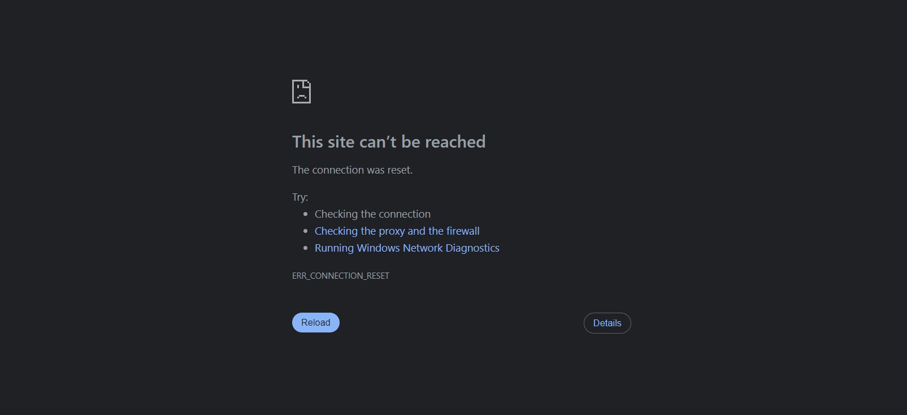
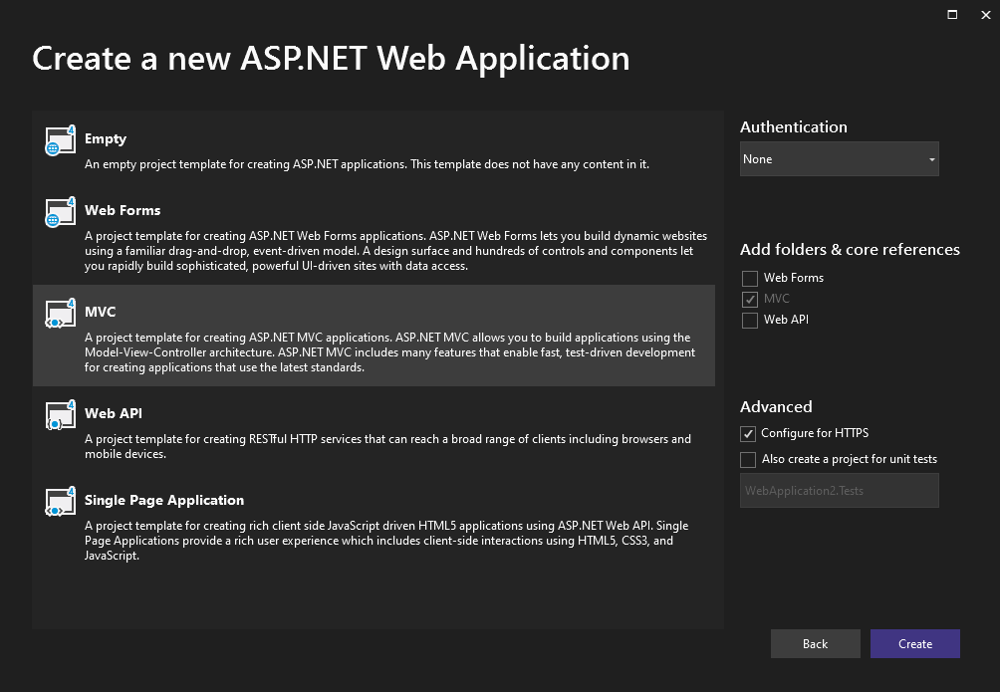
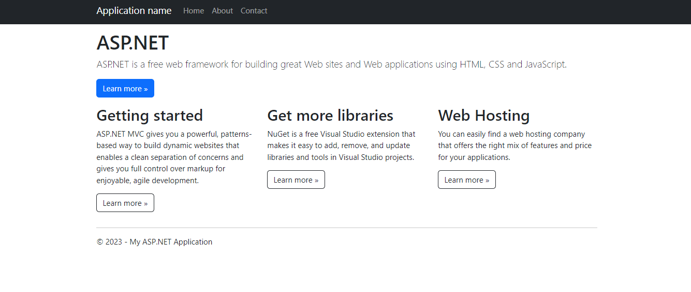

# The connection was reset issue

While trying to create an ASP.NET Application of .NET framework with mvc and I faced the following issues:

The problem primary occured in visual studio 2022 with .NET framework 4.8 and I hade selected `Configure for HTTPS`

Now when I tried to build the application this screen occured

Now the issue occured due to the fact that I had selected `Configure for HTTPS` and I had not configured the SSL certificate for the application. Like this 

So uncheck the `Configure for HTTPS` and then build the application. It will work fine.

