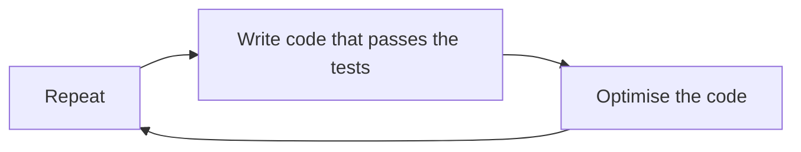

# Refactoring

## What is refactoring?

Refactoring is a disciplined technique for restructuring an existing body of code, altering its internal structure without changing its external behavior

## What does refactoring does?
1. It doesn't fix a 
2. helps finding the bug
3. Does not add a new feature
4. Makes code easier to understand

## Why we write code?
1. Technical debt
    
    a. Intentional
    
    b. Unintentional

2. Ignorance or will do it later attittude


## When refactoring needed?

+ When there is no idea what the code does 
+ When the code is understood but the question of "Why this way arises"
+ After fixing a bug
+ After adding a feature
+ Performance Optimization
+ Readability of code
+ platform of framework changes

## Work flow of refractoring



## Example of Refactoring

### Composing Methods

- Extract Method
- Inline Method
- Inline Temp
- Replace Temp with Query
- Introduce Explaining variables
- Split Temporary Variable
- Remove Assignments to Parameters
- Replace Method with Method Object
- Substitute Algorithm

### Moving Features Between Objects
- Move Method
- Move Field
- Extract Class
- Inline Class
- Hide Delegate
- Remove Middle Man
- Introduce Foreign Man
- Introduce Local Extension

### Organizing Data
- Self Encapsulate Field
- Replace Data Value with Object
- Change Value to Reference 
- Change Reference to Value
- Replace Array with Object
- Duplicate Observed Data
- Encapsulate Field 
- Encapsulate Collection
- Replace Subclass with Fields

### Simplifying Conditional Expressions
- Decompose Conditional
- Remove Control Flag
- Replace Conditional with Polymorphism
- Introduce Null Object
- Introduce Assertion

### Making Method Calls Simpler
- Rename Method
- Add Parameter
- Remove Parameter
- Parameterized Method
- Preserve Whole Object
- Replace Parameter with Object
- Introduce Parameter Object
- Remove Setting Method
- Hide Method

### Dealing with Generalization
- Pull Up Field/Method/Constructor Body
- Push Down Field/Method
- Extract Subclass/Superclass/Interface
- Collapse Hierarchy
- Form Template Method
- Replace Inheritance with Delegation
- Replace Delegation with Inheritance


# OOP

## OOP Principles
The four principles of object-oriented programming are

1. `Inheritance` - The advantage of inheritance is that we define a more generic class and then we go with as many sub-classes as we need. The sub-classes inherit the properties and methods of the parent class. This way we can reuse the code and add new features to the sub-classes.<br>
This also ensures that the code is more readable and maintainable. We can also override the methods of the parent class in the sub-classes. This is called method overriding. So sometime we can merge multiple classes into one class and use inheritance to reuse the code and sometimes we can split a class into multiple classes and use inheritance to add new features to the sub-classes. 

2. `Encapsulation` - It means that we are keeping the information within the class but only revealing what's necessary to the outside world. This is done by using access modifiers. We can use public, private, protected and internal access modifiers to control the visibility of the members of a class. By applying encapsulation, we can make sure that the code is more maintainable and flexible. We can also use encapsulation to hide the implementation details of a class from the outside world. This is called information hiding.

3. `Abstraction` - It makes easier for use to work with only selected behaviours using simplified and high level overview of the object. It is done by using abstract classes and interfaces. We can use abstract classes to define a template for a class. We can then use this template to create new classes. We can also use interfaces to define a contract for a class. We can then use this contract to create new classes. By applying abstraction, we can make sure that the code is more maintainable and flexible. We can also use abstraction to hide the implementation details of a class from the outside world. This is called information hiding.

4. `Polymorphism` - It means that we can have multiple classes that can be used interchangeably. This is done by using inheritance, abstract classes and interfaces. We can use inheritance to create a more generic class and then we can use this class to create more specific classes. We can then use these specific classes interchangeably. We can also use abstract classes and interfaces to create a contract for a class. We can then use this contract to create more specific classes. We can then use these specific classes interchangeably. By applying polymorphism, we can make sure that the code is more readable and maintainable.


## Practical use of OOP Principles
# Code Smells

## Types of code smells with solutions

1. **Rename Field/Variable/Method Name:**


    
```java

public class User {
    String n;

    public void s(String name) { 
        n = name;
    }

    public String g() { 
        return n;
    }
}

```

- Explanation: Poorly named elements in code can make it difficult to understand.
- Solution : Rename the field, variable, or method to something descriptive and meaningful, following established naming conventions.


    
```java

public class User {
    private String userName;

    public void setUserName(String name) {
        userName = name;
    }

    public String getUserName() {
        return userName;
    }
}

```


2. **Long Method:**


    
```java

public class DataProcessor {
    public void processData(String[] data) {
        for (String item : data) {
            if (item.isEmpty()) {
                System.out.println("Error: Data contains empty values.");
            }
        }

        for (int i = 0; i < data.length; i++) {
            data[i] = data[i].trim();
        }

        int[] transformedData = new int[data.length];
        for (int i = 0; i < data.length; i++) {
            transformedData[i] = Integer.parseInt(data[i]);
        }

        for (int value : transformedData) {
            if (value < 0) {
                System.out.println("Error: Negative values are not allowed.");
            }
        }

        int sum = 0;
        for (int value : transformedData) {
            sum += value;
        }

        System.out.println("Result: " + sum);

        if (sum > 100) {
            System.out.println("The sum is greater than 100.");
        } else {
            System.out.println("The sum is not greater than 100.");
        }

        if (transformedData.length > 0 && transformedData[0] == 0) {
            System.out.println("The first element in the transformed data is zero.");
        }

        System.out.println("Processing complete.");
    }
}

    
```
    

- Explanation : A method with excessive lines of code, making it hard to read and maintain.

- Solution: Break the long method into smaller, more focused methods with descriptive names that perform specific tasks.

```java

public class DataProcessor {
    public void processData(String[] data) {
        try {
            checkForEmptyValues(data);
            trimData(data);
            int[] transformedData = transformData(data);
            checkForNegativeValues(transformedData);
            int sum = calculateSum(transformedData);
            printResult(sum);
            printSumComparisonMessage(sum);
            checkAndPrintFirstElement(transformedData);
            printProcessingComplete();
        } catch (IllegalArgumentException e) {
            System.out.println("Error: " + e.getMessage());
        }
    }

    private void checkForEmptyValues(String[] data) {
        for (String item : data) {
            if (item.isEmpty()) {
                throw new IllegalArgumentException("Data contains empty values.");
            }
        }
    }

    private void trimData(String[] data) {
        for (int i = 0; i < data.length; i++) {
            data[i] = data[i].trim();
        }
    }

    private int[] transformData(String[] data) {
        int[] transformedData = new int[data.length];
        for (int i = 0; i < data.length; i++) {
            transformedData[i] = Integer.parseInt(data[i]);
        }
        return transformedData;
    }

    private void checkForNegativeValues(int[] data) {
        for (int value : data) {
            if (value < 0) {
                System.out.println("Error: Negative values are not allowed.");
            }
        }
    }

    private int calculateSum(int[] data) {
        int sum = 0;
        for (int value : data) {
            sum += value;
        }
        return sum;
    }

    private void printResult(int sum) {
        System.out.println("Result: " + sum);
    }

    private void printSumComparisonMessage(int sum) {
        if (sum > 100) {
            System.out.println("The sum is greater than 100.");
        } else {
            System.out.println("The sum is not greater than 100.");
        }
    }

    private void checkAndPrintFirstElement(int[] data) {
        if (data.length > 0 && data[0] == 0) {
            System.out.println("The first element in the transformed data is zero.");
        }
    }

    private void printProcessingComplete() {
        System.out.println("Processing complete.");
    }
}

```

3. **Long Parameter List:**

```java

public class DataProcessor {
    public void processData(String[] data, int threshold, boolean isDebugMode, String dataLabel, String processingStep) {
        // Processing the data
    }
}
```
   - Explanation: Functions with too many parameters can be complex and error-prone.
   - Solution: Use parameter objects to group related parameters, or refactor the method to accept fewer parameters by encapsulating related data in objects.

```java
public class DataProcessor {
    public void processData(DataProcessingConfig config) {
        // Processing logic using the config object
        // ...
    }
}

public class DataProcessingConfig {
    private String[] data;
    private int threshold;
    private boolean isDebugMode;
    private String dataLabel;
    private String processingStep;

    public DataProcessingConfig(String[] data, int threshold, boolean isDebugMode, String dataLabel, String processingStep) {
        this.data = data;
        this.threshold = threshold;
        this.isDebugMode = isDebugMode;
        this.dataLabel = dataLabel;
        this.processingStep = processingStep;
    }

    // Getters for individual parameters if needed

    // Additional methods or validations as needed
}
```

4. **Large Class:**

```java

public class Game {
    private int playerScore;
    private String playerName;
    private String playerLocation;
    private int playerLevel;
    private int playerHealth;
    // ... (more attributes)

    public void playGame() {
        // Game logic here
    }

    public void saveGame() {
        // Save game logic here
    }

    public void loadGame() {
        // Load game logic here
    }

    public void displayPlayerInfo() {
        // Display player information logic here
    }

}


```
   - Explanation: A class that has grown too large and has too many responsibilities.
   - Solution: Divide the class into smaller classes, each responsible for a single aspect, using composition or inheritance if needed.

```java
public class Player {
    private int score;
    private String name;
    private String location;
    private int level;
    private int health;
    // ... (more attributes)

    // Constructor, getters, setters, and relevant methods
}

public class Game {
    private Player player;

    public void playGame() {
        // Game logic here
    }

    public void saveGame() {
        // Save game logic here
    }

    public void loadGame() {
        // Load game logic here
    }
}

public class PlayerInfoDisplay {
    private Player player;

    public PlayerInfoDisplay(Player player) {
        this.player = player;
    }

    public void displayPlayerInfo() {
        // Display player information logic here
    }
}


```


5. **Primitive Obsession:**


```java

public class Weapon {
    private String weaponType;
    private int damage;

    public Weapon(String weaponType, int damage) {
        this.weaponType = weaponType;
        this.damage = damage;
    }
}

```
   - Explanation: Overuse of primitive data types (e.g., strings, integers) instead of creating custom objects to represent concepts.

   - Solution: Create domain-specific classes to encapsulate related data and behavior, improving code clarity and maintainability.

```java

public class Weapon {
    private WeaponType weaponType;
    private int damage;

    public Weapon(WeaponType weaponType, int damage) {
        this.weaponType = weaponType;
        this.damage = damage;
    }
}

public enum WeaponType {
    SWORD,
    AXE,
    BOW,
    SPEAR
}

```

- This can also be an alternative 

```java
public class Weapon {
    private WeaponType weaponType;
    private Damage damage;

    public Weapon(WeaponType weaponType, Damage damage) {
        this.weaponType = weaponType;
        this.damage = damage;
    }

}

public class WeaponType {
    private String value;

    public WeaponType(String value) {
        // Validate and set the value
        this.value = value;
    }

    public String getValue() {
        return value;
    }

   
}

public class Damage {
    private int value;

    public Damage(int value) {
        // Validate and set the value
        this.value = value;
    }

    public int getValue() {
        return value;
    }

}


```


6. **Switch Statement:**
```java 

public class GameCharacter {
    private String characterType;

    public void attack() {
        switch (characterType) {
            case "Warrior":
                performWarriorAttack();
                break;
            case "Mage":
                performMageAttack();
                break;
            case "Archer":
                performArcherAttack();
                break;
            // ... (more cases)
            default:
                throw new IllegalArgumentException("Invalid character type");
        }
    }
}

```
   - Explanation: Overuse of switch/case statements can lead to code that's hard to extend and maintain.
   - Solution: Replace switch statements with polymorphism (e.g., using interfaces and subclasses) or create lookup tables to handle different cases more elegantly.
```java
public interface Character {
    void attack();
}

public class Warrior implements Character {
    // Warrior-specific attributes and methods
    @Override
    public void attack() {
        // Warrior attack logic
    }
}

public class Mage implements Character {
    // Mage-specific attributes and methods
    @Override
    public void attack() {
        // Mage attack logic
    }
}

public class Archer implements Character {
    // Archer-specific attributes and methods
    @Override
    public void attack() {
        // Archer attack logic
    }
}

// Usage example:
public class Game {
    public static void main(String[] args) {
        Character warrior = new Warrior();
        Character mage = new Mage();
        Character archer = new Archer();

        warrior.attack();
        mage.attack();
        archer.attack();
    }
}


```

7. **Duplicate Code:**
   - Explanation: Repeating the same code in multiple places in the codebase.
   - Solution: Extract duplicated code into reusable functions or methods to ensure consistency and maintainability.

8. **Lazy Class:**
   - Explanation: Classes that don't provide much value and have too few responsibilities.
   - Solution: Remove or combine classes that don't contribute significantly to the system, redistributing their responsibilities to more relevant classes.

9. **Feature Envy:**
   - Explanation: One class is excessively accessing or manipulating another class's features.
   - Solution: Refactor the code to move the functionality to the class that owns the data, promoting better encapsulation and modular design.

10. **Temporary Field:**
    - Explanation: A class has fields that are only used in certain situations and aren't needed most of the time.
    - Solution: Remove unnecessary fields or encapsulate them within methods or objects used during those specific situations.

11. **Comments:**
    - Explanation: Excessive or unclear comments can indicate a lack of self-documenting code.
    - Solution: Rewrite the code to be more expressive, use meaningful variable and method names, and only include comments when necessary for explaining complex or non-obvious logic.

12. **Inappropriate Intimacy:**
    - Explanation: Inappropriate relationships and dependencies between classes can lead to tight coupling and complexity.
    - Solution: Refactor the code to reduce unnecessary relationships and encapsulate behavior where it belongs.

13. **Shotgun Surgery:**
    - Explanation: When a single change to the codebase requires multiple edits in various places, it indicates that changes are not localized.
    - Solution: Reorganize the code to make it more cohesive, grouping related functionality together to reduce the need for widespread changes.

14. **Refused Bequest:**
    - Explanation: Subclasses inherit methods and attributes from a superclass but don't use or need them, leading to an awkward inheritance hierarchy.
    - Solution: Refactor the class hierarchy, either by removing unnecessary inheritance or breaking the superclass into more meaningful components.

15. **Middle Man:**
    - Explanation: Classes that serve as intermediaries between clients and the classes they interact with, offering little additional value.
    - Solution: Directly access the classes or refactor the middle man to provide more meaningful services.

16. **Data Class:**
    - Explanation: Classes that only contain data without behavior, essentially acting as simple data structures.
    - Solution: Add behavior to these classes to encapsulate the data's functionality, making the class more useful and expressive.

17. **Incomplete Library Class:**
    - Explanation: Library classes that lack important features or functionality, forcing developers to create their own solutions.
    - Solution: Extend the library class to include missing features or choose a more comprehensive library.

18. **Data Clumps:**
    - Explanation: When groups of data (e.g., parameters) frequently appear together in code, it suggests a missing object to encapsulate them.
    - Solution: Create a class or object to group related data, improving code readability and maintainability.

19. **Speculative Generality:**
    - Explanation: Creating overly complex or abstract code with features that are not currently needed.
    - Solution: Simplify the code by removing unused or unnecessary abstractions, refactoring as required when the need arises.

20. **Message Chain:**
    - Explanation: A chain of method calls between objects, which can lead to tight coupling and reduce code maintainability.
    - Solution: Introduce intermediate methods or encapsulate the chain in a single method to minimize the coupling and improve readability.


Addressing these code smells can lead to cleaner, more maintainable, and more efficient code, ultimately improving software quality and development practices.


## References
+ Book - Refactoring: Improving the Design of Existing Code by Martin Fowler, Ken Beck
+ Refactoring Catalog: https://www.refactoring.com/catalog/index.html
+ Workflow of Refactoring: https://www.youtube.com/watch?v=vqEg37e4Mkw 
+ Book - Design Patterns: Elements of Reusable Object Oriented Software by Gangs of Four (GoF)
+ Refactoring Guru: https://refactoring.guru/ 
+ Source Making: https://sourcemaking.com/
+ Streams Tech Refactoring: https://www.youtube.com/watch?v=ToI4ZHqdDkg&list=PLi7ghxtNM46_s9p_6oxctq1IkRD6PxkfH  


