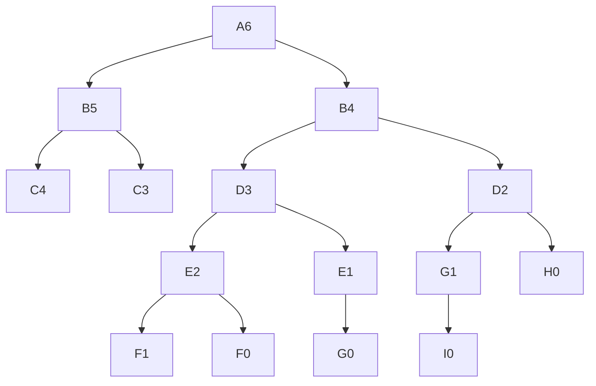
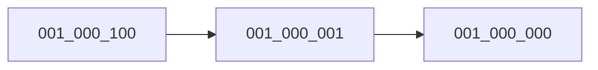

# June 2023

| Date | Things I have learned                                                                                        | Proof                                                                                                                                                                                                                         |
| ---- | ------------------------------------------------------------------------------------------------------------ | ----------------------------------------------------------------------------------------------------------------------------------------------------------------------------------------------------------------------------- |
| 13   | 1. SOD , NOD <br>2.Solved 20 problem on lightoj                                                              | 1. [Problems](https://github.com/piru72/Online_Judge_Solves/commit/ed3be1b558ce148939856d7841cc04eb3384856f) <br>2. [Problems](https://github.com/piru72/Online_Judge_Solves/commit/d2133a6c3012bd4794ef0843c18cd1771b6eef5d) |
| 14   | 1. LCM ,GCD , Euler Totient , BigMOd , Modular Inverse , Extended GCD <br> 2. Solved 10 problems on light oj | 1. [Study](https://github.com/piru72/ICPC_PREPARATION/commit/1d612e369f5b442dba80d89eeec0193a311153c7) <br> 2. [Problems](https://github.com/piru72/Online_Judge_Solves/commit/4fcac178845c8a86b2e4fb2b0de735d0808f9959)      |
| 15   | 1. Solved 8 problems on light oj<br> 2. Combinatronics                                                       | 1. [Problems](https://github.com/piru72/Online_Judge_Solves/commit/6ac7b24ebc4b1d6155cfedc97024a43e445f103e) <br> 2. [Study](https://github.com/piru72/ICPC_PREPARATION/commit/7ae0b04ba46ef92159886a6337ea8738272ee4bf)      |
| 16   | 1. KMP <br> 2. Problems of kmp                                                                               | 1. [problems](https://github.com/piru72/Online_Judge_Solves/commit/3be15b88c9fcd92c665929887392d54ee4be753a)                                                                                                                  |
| 17   | 1. Rabin Karp                                                                                                | 1. [Problem](https://github.com/piru72/Online_Judge_Solves/commit/d491d557194912515193479b2d63c1a55e90de91)                                                                                                                   |
| 18   | 1. Atcode Beginer easy                                                                                       | 1. [Q](https://kenkoooo.com/atcoder/#/training/Boot%20camp%20for%20Beginners/1) [Ans]()                                                                                                                                       |
| 19   | 1.Solved Leetcode , cf                                                                                       | 1. [Q]                                                                                                                                                                                                                        |
| 20   | 1.Solved Leetcode(neetcode array) , cf(string 1000 , contest) , atcoder(easy)                                | 1. [Q]                                                                                                                                                                                                                        |
| 21   | 1.Solved Leetcode(Neetcode stack) , atcoder(easy)                                                            | 1. [Q]                                                                                                                                                                                                                        |

# 1 July 2023

So today I started the day watching video [this]() video. Point I found useful

1. solving problem randomly will give you a better view to understand all the possible way of solving the problem instead of learning topicwise which will already tell you which approach to choose.
2. Follow someone who is closer to your current stats
3. Upsolve problems
4. Instead of focusing on lots of algos learn few with deep understanding.
5. `learn when you are stuck`
6. `Make your weak point the strongest`

Sovled problem from 1.1 [Practice] Introduction to Competitive Programming
Contest 1: Very Basic Practice

```
1. It's better to use const when the value is constant
2. It is always better to use fixed when you use setprecision
3. Keep check for tle constrains
4. c/c++ division operator does floor division by default IF a and b are integers
5. \n instead of endl
6. isUpper , isAlpha , toLower , toUpper rather than ascii conversion
7. When value is not needed just the decision is needed log can be used for large values
```

# 2 July 2023

sovled problem from 1.1 [Practice] Introduction to Competitive Programming
Contest 2: Loops Practice

```
1. Avoid using long long int when not needed
2. Keep check for tle constrains
3. Always check for lema in case of large constrains . Generate hadnwrittern solves and find the pattern from there
4. Use bitwise where possible for faster execution . For finding base 2 use log2
5. Keep in check for worst case . Calculate problems solution for worst case if mind is emtpy then do bruteforces then try to find pattern and then try to find the solution with efficient algo
6. Keep an eye for perfection
7. Use stl when possible
```


<details>
<summary> sieve</summary>

```cpp

vector<bool> mark(1000000, true);
vector<int> primes;

void sieve(int n)
{

    mark[0] = mark[1] = false; // 0 , 1 is not prime

    for (int i = 4; i <= n; i += 2) // even numbers are not prime
        mark[i] = false;

    primes.push_back(2); // 2 is prime

    for (int i = 3; i <= n; i += 2)
    {
        if (!mark[i])
        {
            primes.push_back(i); // i is prime

            if (i * i <= n + 2)
            {
                for (int j = i * i; j <= n; j += i * 2) // cutt off all the multiples of i
                    mark[j] = false;
            }
        }
    }
}
```

</details>


```cpp
/*
For doing prime factorization also can be used for finding disticnt prime divisors count

*/
int numberOfPrime(int n)
{
    int primeCount = 0;

    for (int i = 0; i < primes.size(); i++)
    {
        //cnt++;
        int prime = primes[i];
        if (n % prime == 0)
        {
            primeCount++;
            while (n % prime == 0)
            {
                n /= prime;
                //cnt++;
            }
        }
        if (n <= 1)
            break;
    }

    return primeCount;
}


```

1.  Double and pow might give precision issues have to be careful to use them
2.  int can hold upto 2* 10^9 and long long int can hold upto 9*10^18
3.  Whenever using double loops always check for i , j are written properly

# 3 July 2023

Well took the class of warm up 3 solved porblems for function and recursion.

1. 0 %2 = 0
2. Using dp in fibonacci reduces the time complexity from exponential to linear from 2 second to 2ms using dp

```cpp
// For getting total time elapsed in code
  cerr << "\n\n\n"<< (float)clock() / CLOCKS_PER_SEC * 1000 << " ms" << endl;
```

```cpp
// For fast io
    ios_base::sync_with_stdio(false);
    cin.tie(NULL);
```

# 4 July 2023

`F. Eating Candies cf rating 1100` used suffix and prefix sum to solve the problem. The problem could be sovled using binary search as I could clearly see a monotonic function. But I was not able to implement it. I have to practice more on binary search. So chose to implement it using map to find out if a number occurs twice and as it was in linear time it got solved .

Currently sovling problems from cftracker.

```
!!!!!!!!!! Solved my first ever bit releated problem of rating 1300 !!!!!!!!!!
```

## [Maximal AND](https://codeforces.com/contest/1669/problem/H)

## [Answer the Queries](https://toph.co/p/answer-the-queries)

```
1. Solving approach
We have to keep an eye as there was no update operation needed so we can use a map to store the indices of a value so they are consistant.
Then just use the query to find the maximum value in range and pick out the indices of that value from the map and then we gotta check which indices are in the range to get the answer. which can be done by using uppre and lower bound

2. Mistakes
Also the thing that got me two wa  is this
>> if (l > r) return 0;

as the value could be negative I had to handle the case like this
>> if (l > r) return -1e9;

Also during building the tree it is better to store a single value rather than pair as it will be easier to handle the case of leaf node.

```

## Finding out the maximum value in a range using segment tree

The tree will be built in such a way that the root node will contain the maximum value in the range l to r .The query will return the maxium value in the range l to r .

```cpp
const ll N = 1e5 + 5;
int tree[4 * N];

// Here we are using 1 based indexing

void build(vector<int> arr, int current_node, int left_end, int right_end)
{
    // If the current node is a leaf node then store the value of the array at that index
    if (left_end == right_end)
        tree[current_node] = arr[left_end];

    else
    {
        int mid = (left_end + right_end) / 2;

        // THESE FORMULAS ARE FOR 1 BASED INDEXING
        int left_node = current_node * 2;
        int right_node = current_node * 2 + 1;

        build(arr, left_node, left_end, mid);                        // Build the left subtree
        build(arr, right_node, mid + 1, right_end);                  // Build the right subtree
        tree[current_node] = max(tree[left_node], tree[right_node]); // Update the current node
    }
}

// Query the segment tree for the max elements in range [l, r]
int query(int v, int tl, int tr, int l, int r)
{
    if (l > r) return -1e9;
    if (l == tl && r == tr)
        return tree[v];

    int tm = (tl + tr) / 2;
    return max(query(v * 2, tl, tm, l, min(r, tm)), query(v * 2 + 1, tm + 1, tr, max(l, tm + 1), r));
}
```

# 5 July 2023

## Binary lifting
```
You are given a tree with n nodes numbered from 0 to n - 1 in the form of a parent array parent where parent[i] is the parent of ith node. The root of the tree is node 0. Find the kth ancestor of a given node. 
```
### [Kth Ancestor of a Tree Node](https://leetcode.com/problems/kth-ancestor-of-a-tree-node/)

```
1. Solving approach
Well the first thing I could asume was that I could easily run a dfs to the parent bu again there ar Q queries so doing brute force will just give me cute tle . Now big bro Errichto came to enlighten me with his concept of binary lifting . 

19 -> 10011 so we can basically get 19 by adding up 16+2+1 . in the same way we can just do jumps in power of two to reach that level of anecstor now this wil always be possible because every number can be represented as a sum of power of two . 

So for that each bit that is turned on we will jump upto that level if that is possible. This idea of jumping from one node two another node in power of two is known as binary lifting.

So to do binary lifting we will have to pre process the tree and store the 2^i th ancestor of each node in a dp array . Then we can just jump to the kth ancestor of a node by using the dp array.


```

```cpp
class TreeAncestor {

    vector < vector <int>> up;
    vector < int > depth;
    int LOG  = 20;
public:
    TreeAncestor(int n, vector<int>& parent) {
         
          up = vector < vector <int >> (n , vector<int>(LOG));
          depth = vector <int>(n);
      
          parent[0] = 0;

        // finding the parent of node v and keeping it in the first indice
          for (int i = 0 ; i < n ; i++) up[i][0] = parent[i];

          for (int i= 0 ; i < 100 ;i++)
            {
                for(int j = 1; j < n ; j++)
                    depth[j] = depth[parent[j]] +1;
            }

          for (int j  = 1 ; j  < LOG ; j++)
          {
              // counting rest of the possible jumps from that point in the power of 2 2^1 , 2^2 , 2^2
             
              for (int i = 0 ; i < n  ; i++){
                 up[i][j] = up [ up[i][j-1] ] [j-1];
               } 

          }

    }
  
    
    int getKthAncestor(int node, int k) {
        if (depth[node] < k) 
            return -1;

        for (int i = 0 ; i < LOG ;i++)
        {
            if (k &(1<<i))
                node = up[node][i];
        }

        return node;
    }
};
```
### TLE solution

[Kuriyama Mirai's Stones](https://codeforces.com/contest/433/submission/212149836) This submission has only one issue instead of passing reference to the vector in the function I was passing the whole vector which was basicaly copying the whole vector that took some additional time and gave me tle . 
```
ALWAYS TRY TO PASS REFERENCE TO A FUNCTION INSTEAD OF PASSING THE WHOLE VECTOR
```


# 6 July 2023


## XOR properties
```
1. XOR of a number with itself is 0
2. XOR of a number with 0 is the number itself
3. XOR is commutative and associative
4. XOR of a even number and successive odd number is always 1
5. As xor of two same number is zero this property can be used to find the missing number in an array if it is said that all number comes in pair except one
6. As xor from 1 to n can be found using constant time this property can be used to find xor in a given consecutive range
```
## Finding missing number from an array using xor
<details>
<summary> code </summary>

```cpp
// problem link https://www.spoj.com/problems/OLOLO/en/
#include <bits/stdc++.h>
using namespace std;

int32_t main()
{

    ios_base::sync_with_stdio(false);
    cin.tie(NULL);
    int n ,ans = 0, x = 0;
    
    cin >> n;

    // here x = 0 as xor of a number with 0 is the number itself

    for (int i = 0; i < n; i++)
    {
        cin >> x;
        // finding xor of the array
        ans ^= x;
    }

    // why this ? its done in consant space and time complexity
    /*
    test case  :
        7
        2 4 6 4 2 2 2

        output : 6

        2^4^6^4^2^2^2 = 6

        we can get a better view if we sort them  just to understand it 

        2 2 2 2 4 4 6

        so we can see that 2 and 4 comes in pair but 6 is left alone so we can find it using xor

        in binary  they are 

        010
        010
        010
        010
        100
        100 --> upto this level we can see that they are coming in pair so we can just xor them and get 0
        110

    */

    cout << ans << endl;
    return 0;
}
```

</details>


## Finding XOR in range 0< l <= r <= 1e12
<details>
<summary> Code  </summary>
    
```cpp
// https://atcoder.jp/contests/abc121/tasks/abc121_d?lang=en
ll xor0toN(ll n)
{
    ll ans = 0;
    while (n >= 0 and n % 4 != 3)
    {
        ans ^= n;
        n--;
    }
    return ans;
}

ll xor_l_to_r(ll l, ll r)
{
    return ((l > 0 ? xor0toN(l - 1) : 0) ^ xor0toN(r));
}

/* the idea is to find xor from 0 to l-1 and xor from 0 to r and then xor them to get the xor from l to r

now the question is how to find xor from 0 to n in constant time as it can be in worst case 1e12
we can observe a pattern here that

we can observe an pattern here that

1^2 =1  3^4= 1  5^6 = 1 7^8 = 1

so it is basically XOR of an even and successive odd number is always 1 . now we can look a bit deeper

[(1^2 =1)  ^ (3^4= 1) = 0 ]  [(5^6 = 1) ^ (7^8 = 1) = 0] so for each 4 block we are getting 0 now we gotta find the last block which is not 4 
so for that we are iterating backword till we hit the end of the last block end because then we know when the block ends it will always be 0 . so we can just xor the last block with the block before it and get the answer

A detailed explanation can be found in 
https://www.geeksforgeeks.org/find-xor-of-numbers-from-the-range-l-r/

 */


```
</details>


```
1. To find sum in a range in an constant array we can use prefix sum array to find sum from l to r in constant time we can just do prefix[r] - prefix[l-1] to get the sum in that range the code must handle the case of l = 0 as prefix[-1] will give error

2. Passing reference to a function instead of passing the whole vector can save a lot of time and space as passing the whole vector will copy the whole vector and that will take a lot of time and space

3. Right shift operator can be used to divide a number by 2 as it is faster than dividing it by 2

4. Left shift operator can be used to multiply a number by 2 as it is faster than multiplying it by 2

5.Using next_permutation() we can find the next permutation of a string or a vector in lexicographically order


```

## Given an integer N . Find the number of digits in N in the base k
<details>
<summary> Solution </summary>

```cpp
// https://atcoder.jp/contests/abc156/tasks/abc156_b?lang=en
int main()
{
    int n, k;
    cin >> n >> k;
    cout << floor(log2(n) / log2(k)) + 1 << endl;
    return 0;
}

/*
    the idea is to find the log of n in base k and then add 1 to it to get the number of digits in n in base k
    log(n) base k = log(n) / log(k)
    floor(log(n) base k) + 1 = number of digits in n in base k

    why floor ? because log(n) base k can be a decimal number  wehen n is a power of k or logn is divisble by logk and we need to round it down to get the number of digits  
*/
```
</details>


## KMP
<details>
<summary> Code </summary>

```cpp
VI computeLPSArray(string pat, VI lps)
{
    int len = 0;
    lps[0] = len;
    int i = 1;

    while (i < pat.size())
    {
        if (pat[len] == pat[i])
            ++len, lps[i] = len, i++;
        else
            len != 0 ? (len = lps[len - 1]) : (lps[i] = len, i++);
    }

    return lps;
}

int KMPSearch(string txt, string pat)
{
    int PAT_SIZE = pat.size();
    int TXT_SIZE = txt.size();

    VI lps(PAT_SIZE, 0);

    lps = computeLPSArray(pat, lps);

    int count = 0;

    int i = 0;
    int j = 0;
    while ((TXT_SIZE - i) >= (PAT_SIZE - j))
    {
        if (pat[j] == txt[i])
        {
            j++;
            i++;
        }

        if (j == PAT_SIZE)
        {
            count++;
            j = lps[j - 1];
        }

        else if (i < TXT_SIZE && pat[j] != txt[i])
        {
            if (j != 0)
                j = lps[j - 1];
            else
                i++;
        }
    }

    return count;
}
```
</details>

## RABIN KARP
<details>
<summary> Code </summary>

```cpp

ll hashValue(char c)
{
    return ((c - 'a' + 1) * 7);
}

int RABIN_KARP(string text, string pat)
{

    ll desiredHash = 0, currentHash = 0;

    int M = pat.size();
    int N = text.size();

    for (int i = 0; i < M; i++)
        desiredHash += hashValue(pat[i]);

    for (int i = 0; i < M; i++)
        currentHash += hashValue(text[i]);

    int i = 1;

    int count = 0;
    string ans = text.substr(i - 1, M);
    while (i <= (N - M + 1))
    {

        if (currentHash == desiredHash && ans == pat)
            count++;

        currentHash -= hashValue(text[i - 1]);
        currentHash += hashValue(text[i + M - 1]);
        ans.erase(ans.begin());
        ans += text[i + M - 1];

        i++;
    }

    return count;
}
```
</details>

# 7 July 2023
## Random facts 
```
1. 1!  = 1 , 2! = 2 , 3! = 6 , 4! = 24 , 5! = 120 , 6! = 720  from now on each factorial will end with 0 and if when such a case arrive after that each factorial will have a 0 at the end we can use this property to find out b! / a! where b > a and 0<= a <= b <= 1e18 .  We can optimize it a bit considering the fact that to calculate b! / a! we can just calculate (b * b-1 * b-2 ... a+1) [problem](https://codeforces.com/contest/869/submission/212370670)
```


## Data Structure - Beginner (BACS-BUBT National Programming Camp, 2017)

### Given a string find out which characters occur odd times in the stirng without using any extra space

<details>
<summary> Solution </summary>

```
The idea is to use a bit mask to store the occurence of the characters in the string . We can use the fact that if we xor a number with itself it will become 0 . So each time a character occurs we can just toggle the bit and at the end we will be left with the bit mask of the characters that occured odd times in the string . We can then iterate over the string and check which characters have the bit mask set to 1 and print them out . 
```

</details>


### [UVA 540](https://onlinejudge.org/index.php?option=onlinejudge&Itemid=8&page=show_problem&problem=481)
```
This problem demonestrates use of 2d queue . Where we weill use a 2d queue to store the ids of team in a certains indexes queue
```
### [UVA 12207 Yet another queue]()
```
Use of dequeue or queue to solve the problem
```

# 8 July 2023

Well saw some videos about dynamic programming from luv and there he discussed about some problems. The main thing i captured was the defination of dp I can go top to bottom or I can go bottom to top. <br>
now in top to bottom we mainly use recursion and we try to decompose the main problem into some simmilar smaller problems. Now while we are claculating a problem we try to store that in a place so that the repetative work gets cancelled out.so that we can just focus on new things. 
consider it with an example.  Suppose you are a traveller and now are travelling to sikkim so for the first time when you will be going there you will obviously not know where to start from or how to get there so you ask a lot of queztion to everyone and finally create a map and list of info about the details and you complete a happy sikkim trip. 
now after a year you are agin going to sikkim. Now what will happen? If you are not an dummy traveller like me you have probably listed all the details about your previous trip and you are ready to go.  However if you did not then you would have to do the same processs again to gather information. So we memorize things or steps and try not to repeat same things twice. This thing in prohramming can be
 reffered as memoization that you memorize a certain things. 

Now you need to go to sikkim but you have again forgot the route. But you havent forgotten the full details you know how to go to shiliguri from dhaka. won't you use this information? just because you dont know the whole route?  Well you will and you should use as much previous knowledge as possible to do less things and do nee things only when required.  so once you arrive shiliguri you can just do a little bit of work to go to shiliguri. In such way we can use dynamic programming. So that's easy? He He easy to say easy to code, tough to understand the problem! best of luck!

# 9 July 2023
learned nothing new saw some podcasts of errichto and mock interview related question from youtube 


# 10 July 2023
Another unproductive day with no real progress
## Random Facts
```
1. Bishop move is only valid if `(abs(x - i) == abs(y - j) && abs(y - j) > 0)` . In some cases this can be furthre modified to `(abs(x - i) == abs(y - j) && abs(y - j) >= 0)` which means that the current place of the bishop is also countable . Else it will be valid only if  a bishop is traveling from (x1,y1) to (x2,y2)
.This move is legal on an empty board if you have that: |x2−x1|=|y2−y1|>0 
You can find more about this from here https://math.stackexchange.com/questions/1566115/formula-that-describes-the-movement-of-a-bishop-in-chess
Sample code is given below
```
<details>

<summary> From a place x ,y all posssible moves value of a bishop including the current place </summary>
 
```cpp
// https://codeforces.com/contest/1676/problem/D
ll getVal(int x , int y , vector <vector<int>> &v)
{
    ll ans = 0;
    rep(0 , v.size())
    {
        for (int j = 0 ; j < v[i].size() ; j++)
        {
            abs(x - i) == abs(y - j) && abs(y - j) >= 0 ? ans += v[i][j] : ans += 0;
        }
    }
    return ans;
}

```

</details>


# 11 July 2023

## Random Facts
```
 1. Each time a map is accessed randomly it alocates a new memory and stores the value there . So if we are using a map in a loop and we are not sure about the size of the map we can use a map.clear() to clear the map and free the memory . This will help us to avoid memory limit exceeded error . If we do ignore this we migh ecnounter a memory limit exceeded error . Like this 
 (https://codeforces.com/contest/1676/submission/213180728) . Here we are acessing 1 to 1e9 and each time we are checkign the value in the map which is also assigning 0 value in that position which is causing mle before it is giving us tle that why I was getting mle thanks to fatin for pointing it out.
 
```

# 16 July 2023

## SQRT Decomposition

Well suppose there is a given array of size n and there can be two operation . 
1. Show the sum from l to r
2. Update value at a certain index 

So in such case the bruteforce way is to find the sum again and again which is not feasible in worst cases as in worst case it will be n^2 . Then we can solve it using segment tree . We can also do it by sqrt decomposition . What is this new term now ? <br>

So the idea is to divide the array into several pieces and keep track of the sum of each piece. So if we have an array of size 10 we can divide them into 3/4 part and keep track of the sum of each part . So if we want to find the sum from 1 to 5 we can just find the sum of the first part and the last part and then iterate over the middle part and add them up . So this will be sqrt(n) + sqrt(n) + sqrt(n) = 3sqrt(n) . So this is better than n^2 but not as good as segment tree . But the good thing is that it is easier to implement than segment tree . So if we have a problem where we need to find the sum of a range and update a value at a certain index we can use sqrt decomposition .

So in which size we will be partitioning the array ? Given size of n we can set each size to size of sqrt of n . in such way last part may not always be fully filled up unless the size is a square number. So we can just keep track of the size of the last part and then iterate over the last part to find the sum .

So how to update a value ? Well we can just find the part where the value is and then update the value in that part and then update the sum of that part .

So how to find the sum ? Well we will here have threee part  In the first part we will find th sum of the first part as the l may not always be the start of our partition . The middle part will 


## Custom Comparator 

Sometimes we may need to use custom comparator operator to do some sorting in such cases we can always use a custom comparator . Suppose we have a vector of pair and we want to sort it in a certain way . Then we can use a custom comparator to do that .

<details>
<summary>Code </summary>

```cpp

// Given n points in a two dimensional space, sort all the points in ascending order.

// (x1, y1) > (x2, y2) if and only if (x1 > x2) or (x1 == x2 and y1 < y2) 
bool cmp(pair<int, int> a, pair<int, int> b)
{
    return (a.first > b.first) or (a.first == b.first && a.second < b.second);
}

void solve()
{
   
    vector < pair < int , int >>  v;
    sort(v.begin(), v.end(), cmp);

}


```
</details>


# 18 July 2023

Solved codeforces 640 div 4's 1500 rated problem 


# 19 July 2023

## Maximum SubArray Sum (Kadanes Algorithm)

Kadanes algorithm is used to find the maximum sum of a subarray . So suppose we have an array of size n and we want to find the maximum sum of a subarray . So we can just iterate over the array and keep track of the maximum sum of a subarray . So how to do that ? Well we can just iterate over the array and keep track of the maximum sum of a subarray . So if we are at a certain index we can just check if the sum of the previous subarray is greater than 0 or not . If it is greater than 0 then we can just add the current value to the sum and update the maximum sum . Else we can just update the sum to the current value . So in such way we can find the maximum sum of a subarray .

<details>
<summary> COde </summary>

```cpp

int maxSubArray(vector<int>& nums) {
        int sum = 0;
        int maxSum = INT_MIN;
        for(int i = 0 ; i < nums.size() ; i++)
        {
            sum = max(sum + nums[i] , nums[i]);
            maxSum = max(maxSum , sum);
        }
        return maxSum;
    }

```
</details>

## Random Facts
    
```
    1. If we are using a map and we are not sure about the size of the map we can use a map.clear() to clear the map and free the memory . This will help us to avoid memory limit exceeded error . If we do ignore this we migh ecnounter a memory limit exceeded error . Like this
    2. Keep check for size of n to get a idea about the solving technique . If n is small then we can use brute force . If n is large then we can use some other technique . Today solved a cf Question https://codeforces.com/contest/550/submission/214458722 here I ignored the size of n and couldnot come up with a solution at first then seing at the size of n I could come up with with bitmask solution.
    3. In cc contest well try to implement bruteforce first and then try to optimize it . I was close but lacked the experience.
```

# 20 July 2023

## Maximum  Sub-Array Sum (Prefix Sum)

Before I learned about how to find the maxiumum subarray sum using kadanes algorithm . Today I will talking about doing the same with the help of prefix sum . Now first of all what is prefix sum ?  in prefix sum we will be calculating the sum of all previous values in an array which is known as prefix array . Let us see an example below 

```
Main array = [ 1,2,3,-7,5,6,7]
Prefix Array = [ 1, 3, 6 , -1 ,4 ,10 , 17]
```

So once we are done calculating the prefix array which can be done in O(n) we will be iterating over the array and for each a[i] we will subtract the min till a[i-1] from a[i] and take the maximum from this result . Which is a greedy approach in solving the problem this can be done in O(n)  . We initialize the minimum with 0 . Lets look at an exapmle below .

```
Prefix Array = [ 1, 3, 6 , -1 ,4 ,10 , 17]
i = 6;
min until a[5] = -1;
a[6] = 17
a[i] - in until a[i-1]
= 17 - (-1)
= 18 

```
So the answer will be 18  and we can get the answer by adding `5+6+7 = 18` 

<details>
<summary>Code</summary>

```cpp

ll maximumSubArraySum(vector<ll> prefix)
{

    ll ans = LLONG_MIN;
    ll curr_min = 0;
    for (int i = 1; i < prefix.size(); i++)
    {
        ans = max(ans, prefix[i] - curr_min);
        curr_min = min(curr_min, prefix[i]);
    }

    return ans;
}

```
</details>

# 22 July 2023

## Compression

So suppose we have  1e5 number of nodes which can vary from 1 to 1e9 it will be bidirectional .Now how to take input for such large values ? in the traditional way we cant just create an adjency list because for such a case the size will be an issue and we will get an MLE . So what to do now ? We can just simply use a map to map each node with our desired number so 
```
 1 10
 2 30
 40 3
 
we can map each node like below

1 1
10 2
2 3
30 4
40 5
3 6

```

 In such a way we can map each node with a number and then we can just use the number to create the adjency list . But what if we have to do some dfs or bfs ? Well we can just use the same map to map each node with a number and then we can just use the number to do dfs or bfs . So in such way we can use dfs compression to solve the problem .

 Also in another map or vector we can store the real node value of the number so that we can use it later .

 ```
 1 1
 2 10
 3 2
 4 30
 5 40
 6 3
 ```

 We can achieve this by using any data structure like map or vector . THe same method can be applied when dealing with string and dfs

Related problem can be found named "Ladder Takahashi" in atcoder


# 23 July 2023

Created an Python AI game using min max algorithm in google collab.

# 24 July 2023

Participated in codeforces div 2 contest solved B and did a satisfactory implementation of B . Rank 6563. Gave time debugging other peoples code in BCS

# 25 July 2023

Practiced recursion from codeforces , participated in div 3 solved 3 , not satisfactory 

# 26 July 2023

## Problem 

Fatin and nafis are very good friends . They talk to each other every now and then and sometime people tries to interrupt them and they get angry . So they decided to create a secret language so that no one can understand the language and they can talk to each other freely.
At first any one of them will say a word then he will say a big encrypted word using that line. The othre person will hear the keyword and the encrypted sentence and will decrypt it . Now yusha is a very talented you batchmate of them and he wants to know what they are talking about . So he figured out that the first word they say is the keyword and the encrypted sentence they say has some relation to it. He also found out that . They first write the keyword in a line and then they start writing the sentence in the next line but they never only write till the length of the keyword in a single line .

# 28 July 2023
 Worked on university c# project

# 29 July 2023

## Random Facts
```
1. How to find if a number has any odd divisor (greater than 1)?
If a number has any odd divisor, it can be written as 2k+1 where k is a positive integer. So if we can find any odd divisor of n, we can conclude that n has odd divisor. So we can iterate from 3 to sqrt(n) and check if any number divides n. If we find any number, we can conclude that n has odd divisor. If we don’t find any number, we can conclude that n has no odd divisor.


This is the way I thought of but this can be improved by using the fact that if a number has any odd divisor then it must have a prime odd divisor . So we can just iterate over the prime numbers and check if any prime number divides n . If we find any prime number then we can conclude that n has odd divisor . If we dont find any prime number then we can conclude that n has no odd divisor . This can be done in O(sqrt(n)) time complexity . 


This can also be improved by just keep dividing the number  by 2 until getting an odd number.Either it’s 1 in which case the number is a power of 2 and has no other positive odd divisor, or it’s an odd divisor greater than 1 This is faster, Θ(log2n)

The best way to do this is by taking the help of it binary representaion . The only possibility for any number n>1 not to have an odd divisor is for n to be a power of two. In binary representation, this means that the number has only one 1 bit and all other bits are 0
i.e. 410=100,12810=1000000
Another property: the number n−1 will have all ones
i.e. 310=11,12710=111111
but it will have one less digit than n . Thus, if we apply logical AND operation to n∧(n−1) , the result will be zero only if n
is a power of two. This is just one line of code regardless of n.

https://math.stackexchange.com/questions/4068562/how-to-find-if-a-number-has-any-odd-divisor-greater-than-1?newreg=0142613c6f2347a6a192bc2effb405c2


```

# 30 July 2023

## Random Facts

```
1 . The maxmium gcd of two number between 1 to is n /2 . This can be proved by taking the example of 6 and 12 . The maximum gcd of 6 and 12 is 6 . So the maximum gcd of two number between 1 to n is n/2 .

```

# 31 July 2023

 ## Count number of divisors from 1 to n using sieve in O(nlogn) time complexity

```cpp

int divisors[10000005];

void countDivisorUsingSieve(int n)
{

    for (int i = 1; i <= n; i++)
        for (int j = i; j <= n; j += i)
            divisors[j]++;
}

```

So in here what happeing is that we are iterating over all the numbers from 1 to n and then we are iterating over all the multiples of that number and then we are increasing the value of the divisors of that number by 1 . So in this way we can count the number of divisors of all the numbers from 1 to n in O(nlogn) time complexity .

# 4 August 2023

Been a lot busy for the last week paritcipated in contest , exhibition etc . Performed poorly in Carrnivals coding combat . 
due to misuse of map hopefully wont repeat it again. TOday started with top and gave a virtual couldnt solve a 1400 rating problem in cf will be trying it  the next day . Will be starting solving toph and lightoj .
# WARNING !!! ALWAYS USE MAP.COUNT()

# 5 August 2023

Participated in div2 codeforces . Sovled tree and dfs related problem . Used compression to do dfs on a tree . Didnt learn anything new apart from these hoping to get pupil.

# 8 August 2020

## BACS Game Theory 1

# Universal Game Theory Logic

```
1. A state is winning if it can reach at least one losing position
2. A state is losing if All the the states it can reach are winning states
```

If we analzye both the quotes what do they actually mean ?  In the first case if we can choose any move that will give the opponent such a position that he will be forced to lose no matter what move he makes only then we can be sure that the other can win . 

In the second case suppose both of our choice leads to such a position that it offers the opponent a position from where if he makes the optimal move he will win then we can be sure that we will lose . Cause remember we are playing optimally .

### Problem 1 

Given a pile of N stones if 2 players move sequentially and can take 1 or 2 stone from the pile player with picking the last stone will win who will win if both of them play optimally ?

### Solution 

In such problems of where moves can be optimal we can just do a simple simulation and find out the winning player. So we can see a patter here that 

for each n is 10 we can observe

```
0 -> 1st player cant make a move so 2nd player wins
1 -> 1st player takes 1 stone so 2nd player cant make a move so 1st player wins
2 -> 1st player takes 2 stone so 2nd player cant make a move so 1st player wins
3 -> here observe no matter how much stone 1st player takes 2nd player can always take 1 or 2 stone and win so 2nd player wins
4 -> 1st player wins
5 -> 1st player wins
6 -> 2nd player wins
```

so after each multiple of 3 it is repeating it self so we can do a simple mod operation here to solve the problem . We can mod the number by 2 to decide which player will win .

```
n % 3 == 0 -> 2nd player wins
n % 3 == 1 -> 1st player wins
n % 3 == 2 -> 1st player wins
```



### Problem 2

A 2 player game starts with the number A= 1 . In each move a  player can multiply A with X (2<= X <= 9 ). First player to make A >= N wins . Who will win if both of them play optimally ?

In here we can run a simulation again for N = 1000 and see the pattern . 

So what can we find here ? Lets come from the opposie side to make 1000 what will be the minimum number required ? 

`ceil(1000/9) = 112` 

if the last player does a move that will give a number more than 112 we will win . So if we define the range 

```
1000 -> inf -> losing state
112 -> 999  -> Winning state
56  -> 111  -> Losing state
7   -> 55   -> Winning state
4   ->  6   -> Losing state
1   ->  3   -> Winning state

```


## NIM

Rule of NIM


```
1. Has to be impartial 
2. Has to be finite
3. Has to be optimal play
4. Both the players have to play in turn 

```
### NIM Game

Nim is a game where there are N piles of stones . In each move a player can take any number of stones from any pile . The player who takes the last stone wins . Who will win if both of them play optimally ?

### Solution

If we take the xor of all the piles and if the xor is 0 then the second player will win else the first player will win .

```
[2 , 5, 4]

2 ^ 5 ^ 4 = 3

[1 , 1 , 1]

```

So the first player will win here !


Then why does this trick work ?

```
010
101
100

111 <- XOR of everything
```

Now the interesting part is why does this trick work ? 

```mermaid
graph TD;
    NZ-->Z;
    NZ-->NZ;
    Z-->NZ;

``````

Here Z means  that the sum of all piles of stonsess are zero and NZ means the xor is  non zero .

 So what does the graph mean ? We can can see that from a Non zero state we can go to both Non Zero state and A zero state . But from a zero state we can only go to a non zero state. And this can be observed by looking  at the below example 

 ```
 1 0 1 0 1
 0 1 1 0 1
 1 1 0 0 0

 0 0 0 0 0 <- XOR of everything
 ```

 Now here whatever moves we do we will end up messing up the current situation and we will end up to a non zero postion . 

 So till now we are certain about two fact 
1. From non zero state we can go to both non zero and zero state
2. From zero state we can only go to non zero state


So at the beginning of the game we calculate the current state of the game by doing the xor and find out if it is zero or not . If it is not zero then the first person playing can move it optimally and force the other person to a zero state . In this way he can ensure his victory .

But if he is given a zero state then he can only move to a non zero state . So he can only mess up the current situation and force the other person to a zero state . So the other person will win .

```
Example of non zero state
[1 , 0 ,4]
001
000
100

Example of zero state 
[2,2]
010
010

```

Keep in mind we are referring here the starting state. 


If we try to simulate the game the optimal strategy will be make a move which will offer the opponenent a zero state . And to do this  we can deduct any number of stones from any pile .

Now how to choose the pile ?

If we are currently in a non zero state we must choose the pile that has the highest bit set which is causing the xor to be non zero . 

```
[1 , 0 , 4]

001
000
100

We can take 3 stones from the 3rd pile to make it zero state . 


001 
000
001

Now the second person will try to make it a non zero state But he cant . So he will take 1 stone from the 3rd pile .

001
000
000

Now If the first person takes a stone from the first pile he wins

Graphical representation of the game is given below

```




### NIM GAME 2

Now in here we are required to find the number of ways to win the game .

### Solution

We can use the same trick as before . We can find the xor of all the piles and if it is zero then the second player will win else the first player will win .

Now we can find the number of ways to win the game by using the same trick as before . We can find the number of ways to make the xor zero . 

So once we choose a pile then we have to deduct the rest of the stones from the same pile so the rest becomes deterministic only choosing the pile becomes the variable .

In the first move we can find the first on bit and check which piles have the same bit set . Then we can choose any of the piles and deduct the rest of the stones from the same pile . In this way we can choose any pile meanning multiple ways.


### Misere NIM
Last player to pick a stone loses . Kind of opposite of the normal NIM game .

### Solution

If all the piles have only one stone and the number of pile is odd then the first player will lose . In every other cas it is just like nim game  meaning if the xor of all is non zero then the first player will win else the second player will win .


### Problem 3 (Is it really a NIM game ?)

1. Given n piles of stone where each stone is marked with a or b

2. Player 1 can only select a pile whose topmost stone is marked with a 

3. Player 2 can only select a pile whose topmost stone is marked with b

4. After selecting a pile one can pick any number of stones from the top of the pile


### Solution

So if try to solve this game using the same trick as before we will find that it is not possible .  Now why it is not possible ? 


Just think if there are multiple piles and some piles has a on top and some piles has b on top . Then can we really cal it a nim game ? Well we can't.

```
Nim game must be impartial . Meaning both the players must have the same set of moves . But in here the first player can only choose a and the second player can only choose b . So it is not impartial and we can not actually use the nim game trick here.
```

So what can we do ?

We can apply a simple greedy approach. For each pile with a on top we can count the number of a on that pile and for each pile with b on top we can count number of b on top . This will give us the total amount of move one can make and whichever player can make more move will win the game. 


### Bogus NIM

1. Same as nim game
2. But player one has a extra stone or player 2 has b extra stone
3. They can add stones from a, b on any pile in a given time


### Solution

So the observation can be pretty simple . Because the additional stones can't effect the outcome of the game . So we can just ignore them and solve the game as a normal nim game .

# 6 September 2023

##  Plain binary search on indice

Well it works in the most basic way and it is not universal so we will not be using it .

```

if (a[mid] == x)  return true; [ if the mid is the answer then return true]

if (a[mid] > x) [ if mid is greater than we can discard the right part]
    r = mid - 1;
else [ if mid is smaller than we can discard the left part]
    l = mid + 1;

```


```cpp

bool binSearch(vector<int>& a, int x)
{
    int l = 0, r = a.size() - 1;

    while (l <= r) {
        int mid = (l + r) / 2;

        if (a[mid] == x)
            return true;

        if (a[mid] > x)
            r = mid - 1;
        else
            l = mid + 1;
    }
    return false;
}
    
```

## Closest to the right 

```cpp
int binSearchRight(vector<int>& a, int x)
{
     int l = 1; // a[l] < x
    int r = a.size() - 1; // a[r] >= x

    int ans = r + 1;

    while (l <= r) {
        int mid = (l + r) / 2;

        if (a[mid] < x)
            l = mid + 1;
        else
            ans = mid, r = mid - 1;
    }

    return ans;
}

```


## Closest to the left 

```cpp
int binSearchLeft(vector<int>& a, int x)
{
     int l = 1; // a[l] <= x
    int r = a.size() - 1; // a[r] > x

    int ans = 0;

    while (l <= r) {
        int mid = (l + r) / 2;

        if (a[mid] <= x)

            ans = mid, l = mid + 1;
        else
            r = mid - 1;
    }

    return ans;
}
```

So the `binSearchLeft` finds out the index which is less or equal than x and `binSearchRight` finds out the index which is  greater  greater than x .

now if we are given a range and told to find the number of elements between that range we can just use the `binSearchLeft` and `binSearchRight` to find the number of elements between that range . 

```cpp
       binSearchLeft(a, r) - binSearchLeft(a, l - 1) //  // number of elements having value <= x
```

# 7 September 2023

## Binary Search for Answer
In real problems, this means that there is some function that determines whether it is good or bad by a number.

```cpp
// monotonic function
bool ok(ll mid)
{
    ll a = (mid / w);
    ll b = (mid / h);

    if (b == 0) 
        return false;
    return a >= (double)n / b; // not multiplying due to overflow
}
ll binSearch()
{

    ll l = 1, r = 1e18;

    ll ans = 0;

    while (l <= r) {
        ll mid = (l + r) / 2;

        if (ok(mid)) {
            ans = mid;
            r = mid - 1;
        } else {

            l = mid + 1;
        }
    }

    return ans;
}
```
[Submission](https://codeforces.com/edu/course/2/lesson/6/2/practice/contest/283932/submission/222145935)
Here this is the basic binary binary search on answer algorithm .  The pointers will move according to the function . Here the function obviously have to be monotonic .

## Binary Search on Answer with Floating Point Numbers

```cpp

// Everything will be same but instead of using integer we will be using double

double l = 0, r = 1e7 + 9;
 
    double ans = 0;
 
    int iterations = 45; // iterations = log (maxAns / eps) where eps is the precision
    // ideally this can be 100 just to be safe
 
    while (iterations--) {
 
        double mid = (l + r) / 2;
 
        if (ok(v, mid)) {
            ans = mid;
            l = mid;
        } else {
            r = mid;
        }
    }

```
[Submission](https://codeforces.com/edu/course/2/lesson/6/2/practice/contest/283932/submission/222171571) Here we are using double instead of integer . And we are using a precision of 1e-6 . And we are running the loop for 45 times as log (1e7/1e-6) = 43 . SO to be safe we are using 45 .

# 9 September 2023
Solved problems related to binary search and gave one virtual contest .

# 12 September 2023

## Binary search to solve MiniMax Problem

In general we can use binary search to solve minimax problem . So what is minimax problem ? 


Minimax problem is a problem is generic kind of porblem when the task is to find the minimum value which is the maxium of some other values . This can also be opposite meaning we can also be asked to find out the maximum value which is the minimum of some other values . In both cases we can use think of binary search to solve the problem .

## Problem 1

Lets say there are n people living in a line and i'th lives in position xi and has a speed vi now they want to meet so where can they all meet where they can meet all meet at the minimum time .

So lets come to the observation

1. We can easily say that we need the minimum time so one part of the equation is actullay done . That there is an requirement for minimum number.

2. Where is the requirement of the maximum number ? Well when can we say that every person has arrived to the spot ? Yes when the last person will arrive to the spot only then we can say that every person has arrived to the spot . So for that we each of the distance selected we need to find out when the last person will arrive or what will be the maximum time required for a person to arrive to that spot . So we require the maximum time of arrival of a person to a place . 


So based on these two observation where we need min(max(time)) we can use binary search to solve the problem .  In every other cas if such function can be formed we can use binary search to solve the problem .

# 13 September 2023


## Rando facts
```
1. Always keep strict track of possible upperbound and lowerbound to make the answer right . Calculate it wisely.

2. Always keep track for the minimum possible answer qutaioi and keep track of special cases like n=1 n = 0 etc .
```

# 19 September 2023

Completed the binary search part from YKW course and solved some problems .

## Random Facts

```
1. boolalpha can be used to output true/false in the terminal

```
# 20 septermber 2023

## Random Facts


1. keep very very strict care for worst case or upper bound in BS
2. Count the upperbound as perfectly as you can 

# 29 September 2023
## 7th class of phase one of you know who
## Divisors the sqrt way

1. We can find every divisor in O(N) but we can do it in O(sqrt(N)) so min (i , j) <= N
2. keep check for the Long long int overflow
3. For every number which aren't perfect we will get even divisors
4. Try to think in reverse 
5. Find all divisor from in O (nlgn) using 
```cpp
// basically sieve of divisor
for (int = 1 ;  i < N  ; i++)
{
    for (int j = i ;  j < N ; j+= i)
    {
        divisors[j].push_back(i);
    }
}

```

6. Using this we can also find out the number of primes in a range in O(nlogn) time complexity


## Primes

1. Have only 2 divisor (1 and that number)
2. If the number has more than two divisor then it is not a prime number
3. For every number there is only one unique prime factorization


## Difference array
Adjecent elements difference and by calculating it we can restore the original array and for every array we will get a unique difference array .

> d[i] = a[i] - a[i-1]

> The main array can be restored from the difference array it is the prefix sum of the difference array

# 29 September 2023

## Random Facts

```
1. For iterating inside primes loop keep the counter in long long int or type cast it
2. There will always be an even number of divisors for a number which is not a perfect square
3. If I am keeping the track of divisors of LL number I should keep the vector in long long also as there will be at least 1 long long number which is the array itself.